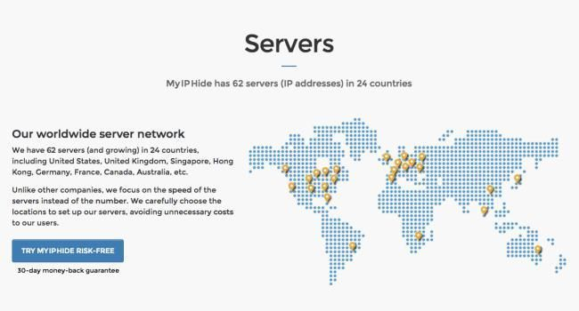
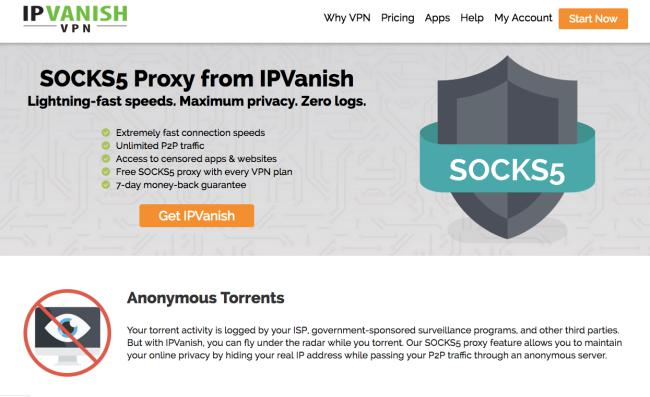
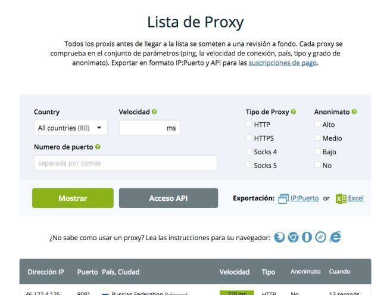
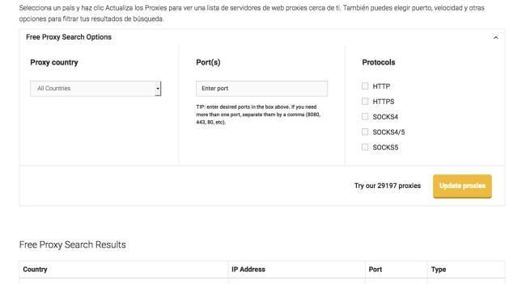

Ya hemos llegado por fin a la 3ª parte: cómo encontrar **proxys gratis** online.

Si ya tienes claro [qué es un proxy (parte 1)](/guias/que-es-proxy) y [cómo configurarlo (parte 2)](/guias/como-usar-proxy)...

Mira aquí los **mejores** servicios seleccionados, para que no tengas que preocuparte de nada.

Esto es lo que vas a ver:

- Opciones de pago (y todas sus **ventajas**).
- Las opciones incluidas _gratis_ en otros servicios.
- Y las opciones 100% **gratuitas**.
- Además, BONUS: la opción **más rápida**.

Vamos!

## ¿Qué opciones tengo para usar un Proxy?

Ya te avisaba de que tienes varias opciones:

- 💰 Puedes pagar una **cuota mensual o anual** por tener acceso a listados enormes de servidores.
- 🚗 Puedes aprovechar los proxys **incluidos** en otros servicios que contrates.
- 🎁 O puedes usar **servidores proxy gratis**.

Te explico cada opción, y **tú decides** qué necesitas en tu caso, ¿vale?

## Los más completos y seguros: Proxys de pago

Normalmente listados de **proxys privados** que te ofrecen la mayor **seguridad y disponibilidad** (para algo pagas).

- En cualquier punto del mundo.

Para que puedas conectarte a través de un proxy en tu navegador o en uTorrent, y **siempre** tengas disponible la ubicación que necesitas.

Los mejores te aseguran que **no mantienen logs de tus conexiones**, así que garantizas tu **anonimato en Internet** todavía más.

Te dejo 2 de los **mejores proxies privados** que puedes encontrar online (con prueba gratuita):

### 1. My IP Hide

Una de las mejores opciones del mundo, y por algo más de 5\$ al mes te aseguran ser **más rapidos** que cualquier otro servicio.

Ubicaciones en más de 20 países para que no tengas problemas para **elegir**.

Te ofrecen una **garantía de reembolso de 30 días**, para que puedas probarlo y ver si es lo que necesitas.

[Aquí tienes el acceso](https://myiphide.com/)

Eso sí, está en inglés

### 2. SERED

En español y creado por **una empresa española**, ofrecen **proxys privados** y distintas opciones de pago.

Una solución profesional si necesitas **usar un proxy para trabajar** (por ejemplo si viajas pero necesitas seguir conectado desde España).

[Este es el acceso a esta opción](https://sered.net/proxy-privado).

## Proxys incluidos en otros servicios

Normalmente se trata de listados incluidos en otros servicios como los VPN

Es decir: **contratas** uno de esos servicios, y una de sus opciones adicionales es un listado de proxys que puedes usar para lo que quieras

Un par de opciones son:

### 1. NordVPN:

Una vez que contratas [el servicio vpn de NordVPN](https://go.nordvpn.net/aff_c?offer_id=15&aff_id=46155&url_id=902), tienes disponibles sus **más de 2.800 servidores en 59 países**

Puedes usarlos como un servicio VPN, pero también para **conectar uTorrent a través de un proxy**

[Tienes el listado entero aquí mismo](https://nordvpn.com/es/servers/)

NordVPN es uno de [los mejores VPN del mundo](/), está en español y tiene uno de los precios más competitivos.

### 2. IP Vanish

[Este proveedor de VPN](https://comousarutorrent.com/ipva) también te ofrece servicios de proxy SOCKS5 para tus descargas en uTorrent.

Eso sí, accedes una vez que **contrates sus servicios** (puedes leer más sobre eso en [la comparativa de los mejores VPN](/))

## Los proxys gratis: ventajas, desventajas, y un listado gratuito

Si quieres usar un proxy al descargar con uTorrent para cambiar tu IP y buscas **opciones sencillas y gratuitas**, esta es tu opción

Tienes disponibles **listados enormes de servidores proxy gratis**, que puedes configurar y usar sin problema

### ¿Quiénes los crean y mantienen?

Algunos servicios de proxies de pago usan estos listados para ofrecerte **una muestra de sus servicios**

- Por supuesto, **promocionan** sus opciones de pago.

Esto es lo mismo que pasa con [los VPN gratis](/guias/vpn-gratis), creados normalmente como promoción. Pero aun así, es **completamente gratuito** usarlos y te servirán en muchas ocasiones

- Simplemente ten en cuenta que es posible que las garantías y anonimato que te ofrecen sean **_menores a un servicio completo_**.

Te dejo dos de las opciones **que mejor funcionan**:

_Con listados completos que actualizan habitualmente_

### 1. HideMy.name

[Este proveedor de VPN](https://hidemy.name/#5f57a8c7dd77e) también te ofrece hasta 1.000 servidores proxy gratis. En un listado actualizado cada muy poco

Con su filtro para que elijas la opción que mejor te viene, como **ubicación o protocolo**.

[Aquí tienes el acceso](https://hidemy.name/es/proxy-list/)

Y en **español**

Un par de **detalles importantes** si vas a usar los proxy gratis de este listado:

- Cuando rellenes los datos de conexión en la **configuración de uTorrent**, deja la casilla «Autenticación» sin marcar. Así no te pedirá usuario ni contraseña y todo funcionará correctamente.
- La **opción de proxy** que tendrás que elegir la tienes en la tabla de proxies. Cada ubicación que elijas tiene disponible un tipo u otro.

Como te decía, estos servidores proxy gratis dependen de _HideMy.name_, un servicio que ofrece VPN también

### 2. Los servidores proxy gratis de NordVPN

El mismo servicio del que te hablaba, [NordVPN](https://go.nordvpn.net/aff_c?offer_id=15&aff_id=46155&url_id=902), ofrece también un listado enorme de proxies gratis (más de 29.000 opciones):

- Tienen un **filtro** para que elijas el país que prefieras
- Y si tienes **preferencias de puerto o protocolo**

Y listo. [Accede haciendo clic aquí](https://comousarutorrent.com/nvpn-proxies-gratis)

Los ajustes que tendrás que usar al configurar el proxy en uTorrent son **los mismos que te explicaba para la opción anterior**

## Proxys web gratis para acceder a webs bloqueadas

Como te explicaba antes, puedes usar **un servicio de proxy web** para acceder a webs que por una u otra razón estén **bloqueadas** en tu caso

- Porque lo haga tu proveedor de internet, el gobierno o un error de tu navegador (esta es una de las formas de [solucionar el error ERR_SSL_VERSION_OR_CIPHER_MISMATCH en Google Chrome](https://comousarutorrent.com/solucionar-err_ssl_version_or_cipher_mismatch/))

Si es algo puntual y no quieres tener que **preocuparte de configurar datos de acceso** en tu navegador, por ejemplo.

Mira un par de servicios de proxy web online que **funcionan a la perfección**:

- [hidester](https://hidester.com/es/proxy/)
- [ProxySite](https://www.proxysite.com/es/)

Puedes encontrar muchos más haciendo **una simple búsqueda online**.

---

Si todavía no tienes claro [qué es un proxy, revisa la parte 1](/guias/que-es-proxy/).

Y si quieres ver [cómo se configuran, mira la parte 2](/guias/como-usar-proxy/).
