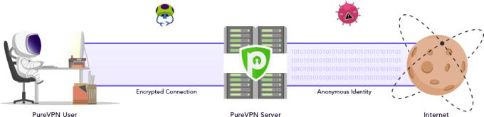

Una VPN es una herramienta **muy potente** para protegerte mientras navegas por Internet. Así de claro.

¿Que cómo te protege?

Cualquier VPN ocultará tu IP y encriptará tu conexión. Así tendrás privacidad y seguridad en la Red.

Idealmente, si usas una VPN mientras estás en Internet, **nadie podrá saber quién eres** ni qué intereses tienes. Nadie podrá saber tus contraseñas, tus datos bancarios, ni tu historial.

Así podrás navegar libremente por Internet, sin miedo a censura, espías, o malware. Sin que tu proveedor de Internet pueda limitar tu tráfico o las webs a las que accedes. Y sin que algunas páginas de bloqueen por estar en algunos países.

¿Suena demasiado bueno para ser cierto? Por supuesto no vivimos en un mundo perfecto y todos los VPNs tienen sus limitaciones. Vamos a ver cuál es la realidad y qué puedes esperar:

## Cómo funciona una VPN

Básicamente, un servicio de VPN crea un túnel virtual que va desde tu dispositivo hasta _el Internet_.

Este túnel es blindado y encripta (cifra) todos los datos para que nadie tenga acceso a ellos: ni tu ISP (proveedor de servicios de Internet) ni cualquier hacker podrá ver tus actividades online.

Las partes importantes del sistema:

### 🔌 La conexión de tu ISP

Tu proveedor de servicios no te ofrece ningún tipo de encriptación. Tus datos _vuelan_ hacia los servidores de Internet sin protección. Esto es lo normal, a lo que estamos acostumbrados, pero no debería ser así. Puedes solucionarlo con un VPN.

### 📱 La aplicación de VPN

Cuando te registres en un VPN e instales su aplicación en tu ordenador o teléfono (o Smart TV, etc.), esta aplicación asegurará tu conexión usando una encriptación de 256-bit (si quieres saber qué es esto, pronto te lo explico).

Así, simplemente con activar tu VPN, tus datos se encriptan y antes de salir de tu dispositivo ya están cifrados.

### 🖥️ Servidor VPN

Cuando tus datos salen de tu ordenador, pasan por el servidor de VPN antes de llegar a Internet. Este servidor cumple unas cuantas funciones:

- Te asigna una IP anónima (en un momento hablamos más sobre la IP). Ninguna página o servicio podrá identificar tu ordenador, sino la IP aleatoria que te asigna tu VPN.
- A través del servidor de VPN, que puede estar en cualquier punto del mundo, tus datos llegarán a Internet desde ese punto, simulando así que te conectas desde otra ubicación. Esto te aporta **anonimato** y **privacidad**.

Elige el mejor VPN para ti en esta [comparativa actualizada](/guias/mejor-vpn-comparativa/).

## Un VPN esconde tu IP real. Así funciona:

Una de las razones principales por las que la gente usa una VPN es porque esconde la IP real de tu dispositivo.

#### ¿Y qué es una IP?

> Una dirección IP es un **número** único que identifica a un dispositivo cuando está conectado a la red.

Como una matrícula. O un número de teléfono.

La IP es única para tu dispositivo, y está relacionada con tu ubicación.

---

Queda registrada en muchas webs y servicios online, para controlar accesos, etc. Y normalmente no es algo negativo que otros sepan tu IP. Eres simplemente un usuario más y _no pasa nada_.

Pero también hay servicios que, basándose en tu IP, pueden conocer tu ubicación y **limitar tu acceso**, mostrarte anuncios más personalizados, cambiar las ofertas disponibles, etc.

Como ya hemos visto, a través de una VPN tus datos se ocultan y tu IP cambia. Cuando te conectas a Internet, tu IP es otra y las webs que visites no saben desde dónde accedes. Tampoco lo sabrán los ISPs, ciber-criminales, o anuncios invasivos.

Esto hace tu experiencia online más **neutral y anónima**, como debería ser.

## Bueno: ¿para qué me sirve todo esto?

[Listado: Todas las ventajas de usar una VPN](/guias/ventajas-de-usar-vpn/)

Usar un VPN para navegar por Internet no tiene inconvenientes. Lo que sí tiene son muchas ventajas:

### 🔐 Navega con seguridad y privacidad

Protege tu información. Tus fotos, videos, documentos. Si decides compartir algo en las redes sociales o en tu blog, que sea tu decisión, y que nadie más pueda **robar** tus recuerdos y tus archivos.

Si [eliges un buen VPN](/guias/como-elegir-mejor-vpn/), te ofrecerá múltiples protocolos para conectarte, muchos países y servidores disponibles, y podrás usarlo en varios dispositivos al mismo tiempo.

Así podrás proteger tu teléfono, tablet, y ordenador, los del resto de tu familia, tu Smart TV, etc. eligiendo la mejor configuración para cada dispositivo.

### 💰 Operaciones bancarias seguras

Una de las situaciones más _sensibles_ en Internet son las operaciones que involucran dinero.

Quizás no te importe mucho que una página te ponga más publicidad si no usas un VPN pero... ¿Y si alguien espiando tu red te robara **la contraseña de acceso a tu banco**? La cosa cambia.

La aplicación de cualquier VPN encriptará tus datos según estos salgan de tu ordenador. Así nadie podrá ver qué información envías, sean contraseñas, datos bancarios, etc.

### 🌍 Elimina restricciones geográficas

Hay muchas páginas web que ofrecen una experiencia _diferente_ según desde dónde te conectes.

No solo el idioma, sino que cierto contenido no estará disponible o será diferente. Al detectar el país desde donde accedes, te redireccionarán a otra web o servicio que tienen para tu país, por ejemplo.

Si lo que quieres es ver **el contenido original**, usa un VPN. Elige el país que quieras en el listado disponible (los mejores VPNs tienen decenas de países para elegir) y conéctate desde esa ubicación.

Listo. La web pensará que accedes desde ese punto.

### 🏎 Elimina limitaciones de velocidad

Hay veces que tu proveedor de servicios de Internet puede limitar tu tráfico a Internet.

Si ven lo que estás haciendo, pueden tener protocolos para **bajar tu velocidad** en determinadas actividades, como por ejemplo al [compartir archivos usando tecnología P2P](https://comousarutorrent.com).

Cuando proteges todo lo que haces en Internet, nadie podrá limitar tu velocidad o restringir tus actividades, porque **no sabrán lo que haces**. Eso es libertad.

---

Si todavía no te ha convencido, [mira todas las demás ventajas](/guias/ventajas-de-usar-vpn/). No tienes nada que perder.
